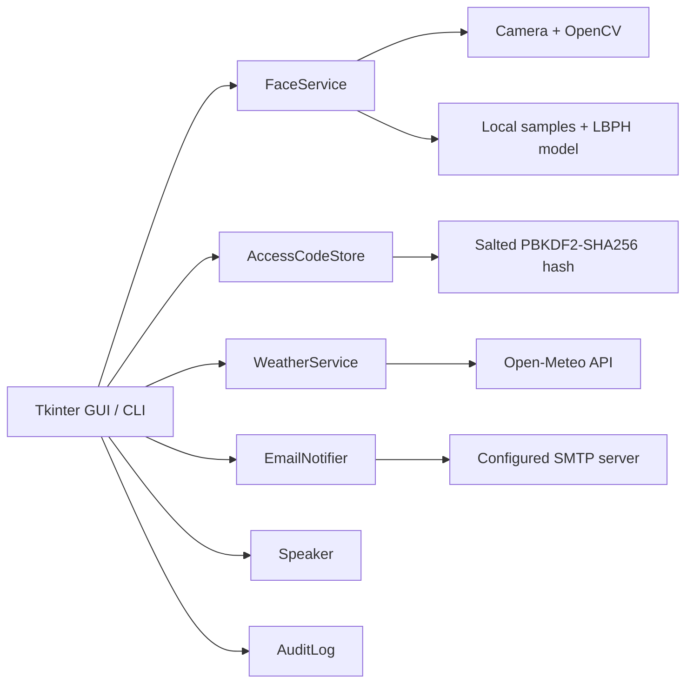

# Smart Door Guardian

A privacy-conscious desktop prototype for local door-access workflows. It combines OpenCV LBPH face recognition, a hashed access-code fallback, optional SMTP alerts, current-weather reminders, offline speech, and a local audit log in one Tkinter GUI and command-line application.

> This repository is an educational prototype, not a certified physical-security product. It does not drive a real lock or GPIO pin. Add an isolated, fail-safe hardware adapter, physical override, power-loss handling, and a professional security review before connecting it to a door.

## Features

| Feature | Behavior |
| --- | --- |
| Face enrollment | Captures cropped grayscale faces from a camera and stores them locally. |
| Face training | Builds a local OpenCV LBPH model and a label map. Empty or unreadable user folders are ignored. |
| Face authentication | Requires the same registered identity to match for several consecutive frames. |
| Access-code fallback | Falls back to a masked access-code prompt when the model or camera is unavailable or recognition fails. |
| Secure code storage | Stores a salted PBKDF2-SHA256 digest instead of the plaintext access code. |
| Intruder alert | Optionally sends an SMTP email after a denied access-code attempt. |
| Departure reminder | Records a departure, fetches current Open-Meteo weather, and optionally speaks the result. |
| Audit trail | Writes local JSON Lines events for application starts, access decisions, departures, enrollment, and code changes. |
| Two interfaces | Provides a Tkinter GUI and a scriptable CLI. |
| Hardware-free start | The basic GUI, diagnostics, access-code fallback, and tests run without OpenCV or a camera. |

Face images, trained models, access-code hashes, `.env`, and audit logs are excluded from Git by default.

## Architecture



## Requirements

- Python 3.10, 3.11, or 3.12
- Windows, Linux, or Raspberry Pi OS
- Tkinter for the GUI
- A camera, NumPy, and `opencv-contrib-python` for face features
- `pyttsx3` and a working system speech engine for optional offline speech
- Internet access only for weather and SMTP alerts

The core package intentionally has no mandatory third-party dependency. Hardware and speech dependencies are optional extras.

## Quick start: demo and access-code mode

This setup starts the application without installing OpenCV.

### Windows PowerShell

```powershell
git clone https://github.com/Fujizzz/smart-door-guardian.git
Set-Location smart-door-guardian
py -3.12 -m venv .venv
.venv\Scripts\Activate.ps1
python -m pip install --upgrade pip
python -m pip install -e .
python main.py diagnose
python main.py
```

### Linux or Raspberry Pi OS

```bash
git clone https://github.com/Fujizzz/smart-door-guardian.git
cd smart-door-guardian
python3 -m venv .venv
source .venv/bin/activate
python -m pip install --upgrade pip
python -m pip install -e .
python main.py diagnose
python main.py
```

If no `.env` or existing access-code file is present, the first start initializes the local demo code as `123456`. Change it immediately with the GUI or `door-guardian set-code`. The plaintext is used only to create the initial hash; it is not written to the access-code file.

The face model is initially absent, so **Home / Authenticate** automatically opens the access-code fallback. Weather failures are displayed without terminating the GUI.

## Install the complete feature set

Use a clean virtual environment and install all optional features:

```bash
python -m pip install -e ".[full]"
python main.py diagnose
```

Equivalent requirements-file installation:

```bash
python -m pip install -r requirements.txt
python -m pip install -e .
```

The `diagnose` command reports the Python executable, project directory, demo mode, model status, email status, and availability of Tkinter, OpenCV, NumPy, and pyttsx3.

## Configuration

Create a private environment file before real use.

Windows PowerShell:

```powershell
Copy-Item .env.example .env
```

Linux or macOS:

```bash
cp .env.example .env
```

Edit `.env` and set appropriate values:

| Variable | Purpose | Default when unset |
| --- | --- | --- |
| `DOOR_DEMO_MODE` | Marks events and the GUI as demo or production mode. | `true` |
| `DOOR_ACCESS_CODE` | Creates the first local hash only when `data/access_code.json` does not exist. | `123456` |
| `DOOR_CAMERA_INDEX` | Index passed to `cv2.VideoCapture`. | `0` |
| `DOOR_FACE_THRESHOLD` | Maximum accepted LBPH distance; lower is stricter. | `65` |
| `DOOR_REQUIRED_MATCHES` | Consecutive matching frames required before access is granted. | `5` |
| `DOOR_MAX_FRAMES` | Maximum frames processed during one recognition attempt. | `300` |
| `WEATHER_LATITUDE` | Latitude used by Open-Meteo. | `29.5630` |
| `WEATHER_LONGITUDE` | Longitude used by Open-Meteo. | `106.5516` |
| `WEATHER_TIMEZONE` | IANA timezone sent to Open-Meteo. | `Asia/Shanghai` |
| `SMTP_HOST` | SMTP server hostname. | empty |
| `SMTP_PORT` | SMTP server port. | `465` |
| `SMTP_USERNAME` | SMTP login user. | empty |
| `SMTP_PASSWORD` | SMTP password or provider app password. | empty |
| `SMTP_SENDER` | Message sender address. | empty |
| `SMTP_RECIPIENT` | Alert recipient address. | empty |
| `SMTP_USE_SSL` | Use implicit TLS; `false` uses SMTP plus STARTTLS. | `true` |

Changing `DOOR_ACCESS_CODE` after the first run does not replace an existing hash. Use **Change Access Code** or `door-guardian set-code` instead.

Never commit `.env`, real passwords, access codes, face images, trained models, or audit logs.

## GUI usage

Start the installed command or the source-tree entry point:

```bash
door-guardian gui
# or
python main.py
```

The GUI provides five actions:

1. **Home / Authenticate**
   - Opens the camera when a trained model exists.
   - Grants access after the configured number of consecutive matches.
   - Opens a masked access-code prompt if recognition is unavailable, cancelled, or unsuccessful.
   - Records `access_granted` or `access_denied` in `data/events.jsonl`.
   - Sends an alert after a wrong fallback code when SMTP is configured.
2. **Leave / Weather Reminder**
   - Records a `departure` event.
   - Retrieves the current temperature, weather condition, and wind speed.
   - Shows the result and speaks it when pyttsx3 is available.
3. **Add Face User**
   - Requests a user name and sample count.
   - Captures samples and retrains the complete model automatically.
   - Press `Esc` or `Q` in the camera window to stop capture. Cancelling before any sample is captured does not start training.
4. **Change Access Code**
   - Verifies the current code.
   - Requires a new code of 6 to 128 characters.
   - Replaces the stored salt and PBKDF2 digest atomically.
5. **Recent Events**
   - Displays the latest 15 local audit records.

## Face enrollment workflow

Good recognition depends on representative samples. Use one directory per person, consistent names, adequate lighting, and a front-facing camera.

### 1. Collect samples

```bash
door-guardian collect alice --samples 80
# or
python main.py collect alice --samples 80
```

The command sanitizes the user name, opens the configured camera, detects frontal faces, and writes cropped grayscale JPEGs to `data/faces/alice/`. Collect approximately 60 to 100 clear images with modest variations in pose and lighting. Press `Esc` or `Q` to stop.

### 2. Train or retrain the model

```bash
door-guardian train
# or
python main.py train
```

Training scans every user directory, ignores empty folders and unreadable JPEGs, then writes:

- `models/lbph_model.yml` — the OpenCV LBPH model
- `models/labels.json` — numeric model labels mapped to user names

Always retrain after adding, replacing, or removing samples.

### 3. Test recognition

```bash
door-guardian recognize
# or
python main.py recognize
```

The command returns exit code `0` after a granted match and `2` after a normal denial or cancellation. Press `Esc` or `Q` to cancel. Unknown model labels are never granted access, even if their LBPH distance is below the threshold.

### 4. Tune recognition

- Reduce `DOOR_FACE_THRESHOLD` to reject more uncertain matches.
- Increase `DOOR_REQUIRED_MATCHES` to require a longer stable match.
- Increase `DOOR_MAX_FRAMES` when camera startup or recognition is slow.
- Recollect samples when lighting, camera position, or appearance changes significantly.

Tune these values using your own device and users. LBPH is suitable for a local prototype but is not liveness detection and does not prevent photo or video presentation attacks.

## Access-code management

Set a new code through a masked prompt:

```bash
door-guardian set-code
```

For automation in a trusted local shell, a value can be supplied directly:

```bash
door-guardian set-code "a-long-local-code"
```

Avoid the second form on shared systems because shell history may retain the plaintext. The GUI change flow verifies the current code before updating it.

The stored `data/access_code.json` contains only the algorithm name, iteration count, salt, and digest. Invalid or tampered metadata fails closed.

## Weather usage

Test the configured location from the command line:

```bash
door-guardian weather
```

The service uses the key-free Open-Meteo current-weather endpoint. A network or response error is reported cleanly by the CLI; the GUI still records the departure and explains that weather retrieval failed.

## Email alerts

Configure all SMTP fields in `.env`:

```dotenv
SMTP_HOST=smtp.example.com
SMTP_PORT=465
SMTP_USERNAME=account@example.com
SMTP_PASSWORD=provider-app-password
SMTP_SENDER=account@example.com
SMTP_RECIPIENT=owner@example.com
SMTP_USE_SSL=true
```

Use a provider-generated app password instead of the primary mailbox password. With `SMTP_USE_SSL=true`, the client uses implicit TLS. With `false`, it connects normally and upgrades with STARTTLS before authentication.

To exercise the alert path, start the GUI, select **Home / Authenticate**, and enter an incorrect fallback code. When SMTP is incomplete, denial is still logged locally and the application continues without sending mail. Delivery errors are shown in the GUI status bar.

## Command reference

```text
door-guardian                 Start the GUI
door-guardian gui             Start the GUI
door-guardian diagnose        Inspect runtime dependencies and configuration
door-guardian collect NAME    Capture face samples for NAME
door-guardian train           Train the LBPH model
door-guardian recognize       Run one recognition attempt
door-guardian weather         Print current configured-location weather
door-guardian set-code        Set the local access code using masked input
door-guardian --help          Show command help
```

The same subcommands work with `python main.py` from the repository root.

## Runtime data

| Path | Contents | Git behavior |
| --- | --- | --- |
| `data/faces/<user>/` | Private captured face images | ignored |
| `models/lbph_model.yml` | Trained biometric model | ignored |
| `models/labels.json` | Model label mapping | ignored |
| `data/access_code.json` | Salted access-code digest | ignored |
| `data/events.jsonl` | Local audit events | ignored |
| `.env` | Local configuration and secrets | ignored |

Back up these files only to encrypted, access-controlled storage. Removing `data/access_code.json` causes the next start to initialize a new hash from `DOOR_ACCESS_CODE` or the default demo code.

## Raspberry Pi notes

1. Confirm the camera works at the operating-system level before starting the application.
2. Install Tkinter and audio dependencies from the OS package manager when required. On Raspberry Pi OS/Debian, packages commonly include `python3-tk`, `libatlas-base-dev`, `espeak-ng`, and `libespeak1`.
3. Create the virtual environment and install `.[full]`. Building or downloading OpenCV may take several minutes.
4. Set `DOOR_CAMERA_INDEX` to the camera index visible to OpenCV.
5. Run `door-guardian diagnose`, enroll users, train the model, and test repeated recognition before enabling automatic startup.
6. Run the process as a dedicated, minimally privileged service account and restrict `.env` and runtime-data permissions.
7. Implement physical lock control in a separate, fail-safe adapter. This repository deliberately performs no GPIO switching.

## Troubleshooting

### `cv2.face` is missing

The standard `opencv-python` package does not include the required contrib face module. In the active virtual environment, keep only `opencv-contrib-python`:

```bash
python -m pip uninstall -y opencv-python opencv-contrib-python
python -m pip install "opencv-contrib-python>=4.8,<5"
```

### The camera cannot be opened

- Close other applications using the camera.
- Check operating-system camera permissions.
- Try `DOOR_CAMERA_INDEX=1` or another valid index.
- Confirm that the process has access to the camera device on Linux.

### Tkinter is missing

Official Windows Python installers normally include it. On Debian or Raspberry Pi OS:

```bash
sudo apt install python3-tk
```

### Speech is unavailable

The application prints the message and continues when pyttsx3 or a system voice engine is unavailable. Install a compatible system engine such as eSpeak NG on Linux.

### Weather or email fails

Run `door-guardian weather` to isolate weather connectivity. Check coordinates, timezone, DNS, firewall, SMTP host/port, TLS mode, and provider app-password requirements. Secrets are never printed by `diagnose`.

## Testing and validation

Core tests require no camera or external service:

```bash
python -m unittest discover -s tests -v
python scripts/check_syntax.py
python main.py diagnose
```

Developer checks:

```bash
python -m pip install -e ".[dev]"
python -m pytest
ruff check .
```

The automated suite covers access-code hashing and tamper handling, configuration parsing, graceful configuration errors, audit records, untrained recognition behavior, optional notifications, weather parsing, and empty face-directory handling. GitHub Actions runs the core test suite and syntax check on Python 3.10, 3.11, and 3.12.

Camera capture, LBPH quality, SMTP delivery, speech output, and live network behavior are external integrations. Validate them on the target hardware using the workflows above.

## Project layout

```text
smart-door-guardian/
|-- src/door_guardian/
|   |-- access.py       # Access-code hashing, verification, and changes
|   |-- audit.py        # Local JSONL event log
|   |-- cli.py          # Command-line entry point
|   |-- config.py       # .env and environment configuration
|   |-- face.py         # Face collection, training, and recognition
|   |-- gui.py          # Tkinter desktop interface
|   |-- notifier.py     # SMTP alert delivery
|   |-- speech.py       # Optional offline speech
|   `-- weather.py      # Open-Meteo client
|-- scripts/            # Convenience and syntax-check scripts
|-- tests/              # Hardware-independent automated tests
|-- data/faces/         # Private local samples; ignored by Git
|-- models/             # Private trained models; ignored by Git
|-- .env.example
|-- pyproject.toml
`-- main.py
```

The mapping from the original prototype scripts to the maintained modules is documented in [`docs/legacy-mapping.md`](docs/legacy-mapping.md).

## Privacy and security

- Obtain explicit consent before collecting another person's face.
- Follow applicable biometric and privacy laws.
- Treat face images and trained models as sensitive biometric data.
- Restrict access to `.env`, audit logs, hashes, samples, and models.
- Rotate any credential that was ever embedded in an older prototype or shared publicly.
- Review [`SECURITY.md`](SECURITY.md) before deployment.

## License

MIT License. See [`LICENSE`](LICENSE).
