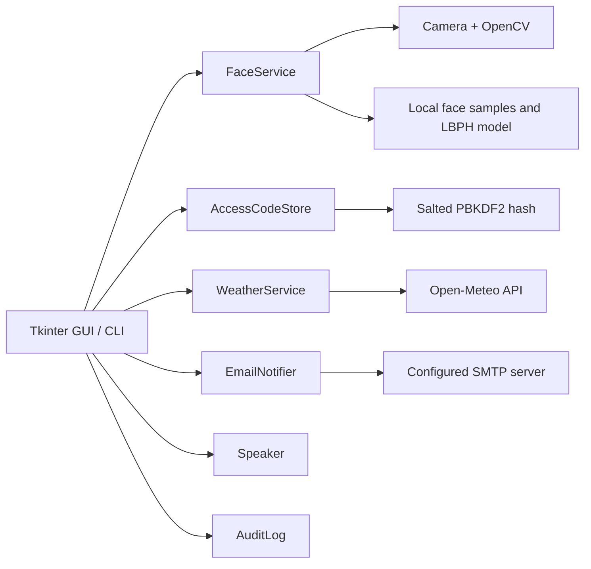

# Smart Door Guardian（智能门神）

一个面向树莓派与普通桌面电脑的本地智能门禁原型。项目将人脸采集、LBPH 模型训练、实时识别、访问码回退、异常邮件、离家天气提醒、离线语音和事件审计整合到统一的桌面界面与命令行中。

> 本项目是教育与原型验证用途，不是经过认证的实体安防产品。连接真实门锁前，请增加独立硬件互锁、断电保护和安全审计。

## 项目亮点

- OpenCV LBPH 本地人脸识别，图像和模型无需上传云端
- 摄像头不可用或模型未训练时自动回退到访问码
- 访问码使用随机盐和 PBKDF2-SHA256 保存，不在源码或磁盘中存明文
- 陌生人访问可通过 SMTP 发送提醒，所有凭据只从环境变量读取
- 使用 Open-Meteo 获取当前天气，无需 API Key
- 使用可选的 `pyttsx3` 进行离线语音播报
- JSON Lines 本地事件日志，便于查看最近访问和离家记录
- GUI 和 CLI 两种使用方式；演示模式无需摄像头、模型或云服务即可启动
- 提供自动测试和 GitHub Actions

## 界面功能

| 操作 | 行为 |
| --- | --- |
| 回家 / 身份验证 | 先执行人脸识别；失败或模型缺失时请求访问码 |
| 出门 / 天气提醒 | 记录离家事件，获取天气并进行语音提示 |
| 添加人脸用户 | 调用摄像头采集样本，随后重新训练 LBPH 模型 |
| 修改访问码 | 验证当前访问码后写入新的安全哈希 |
| 查看最近事件 | 显示最近 15 条本地审计记录 |

## 架构



## 目录结构

```text
smart-door-guardian/
├── src/door_guardian/
│   ├── access.py       # 访问码哈希、验证与修改
│   ├── audit.py        # 私有 JSONL 事件日志
│   ├── cli.py          # 统一命令行入口
│   ├── config.py       # .env 和环境变量配置
│   ├── face.py         # 人脸采集、训练和识别
│   ├── gui.py          # Tkinter 桌面界面
│   ├── notifier.py     # SMTP 异常访问提醒
│   ├── speech.py       # 可选离线语音
│   └── weather.py      # 无密钥天气服务
├── scripts/            # 人脸采集和训练快捷脚本
├── tests/              # 不依赖摄像头的自动测试
├── data/faces/         # 本地人脸样本；Git 忽略
├── models/             # 本地训练模型；Git 忽略
├── .env.example
├── pyproject.toml
└── main.py
```

## 环境要求

- Python 3.10–3.12
- Windows、Linux 或 Raspberry Pi OS
- GUI 需要 Tkinter。Windows 官方 Python 通常自带；Debian/Raspberry Pi OS 可安装 `python3-tk`
- 人脸功能需要摄像头、NumPy 和 `opencv-contrib-python`
- 语音功能可选，需要 `pyttsx3` 以及系统可用的语音引擎

## 快速启动：无硬件演示

基础 GUI 和诊断只依赖 Python 标准库。以下命令不会安装 OpenCV：

### Windows PowerShell

```powershell
py -3.12 -m venv .venv
.venv\Scripts\Activate.ps1
python -m pip install --upgrade pip
python -m pip install -e .
python main.py diagnose
python main.py
```

### Linux / Raspberry Pi OS

```bash
python3 -m venv .venv
source .venv/bin/activate
python -m pip install --upgrade pip
python -m pip install -e .
python main.py diagnose
python main.py
```

首次启动会创建私有的访问码哈希。未配置 `.env` 时，演示访问码为 `123456`；它仅用于本地演示，真实部署前必须修改。

## 安装完整功能

```bash
python -m pip install -e ".[full]"
```

也可以使用：

```bash
python -m pip install -r requirements.txt
python -m pip install -e .
```

如果系统同时安装了 `opencv-python` 和 `opencv-contrib-python`，可能发生 `cv2.face` 缺失。建议在虚拟环境中只保留 `opencv-contrib-python`：

```bash
python -m pip uninstall -y opencv-python opencv-contrib-python
python -m pip install "opencv-contrib-python>=4.8,<5"
```

## 配置

复制配置模板：

```powershell
Copy-Item .env.example .env
```

Linux/macOS：

```bash
cp .env.example .env
```

主要配置：

| 变量 | 说明 | 默认值 |
| --- | --- | --- |
| `DOOR_DEMO_MODE` | 是否使用演示模式标识 | `true` |
| `DOOR_ACCESS_CODE` | 仅用于首次创建本地哈希 | `123456` |
| `DOOR_CAMERA_INDEX` | OpenCV 摄像头索引 | `0` |
| `DOOR_FACE_THRESHOLD` | LBPH 距离阈值；越小越严格 | `65` |
| `DOOR_REQUIRED_MATCHES` | 允许访问前需要的匹配帧数 | `5` |
| `DOOR_MAX_FRAMES` | 单次识别的最大帧数 | `300` |
| `WEATHER_LATITUDE` | 天气位置纬度 | 重庆纬度 |
| `WEATHER_LONGITUDE` | 天气位置经度 | 重庆经度 |
| `WEATHER_TIMEZONE` | 天气时区 | `Asia/Shanghai` |
| `SMTP_*` | 可选异常访问邮件配置 | 未配置 |

`.env` 已被 Git 忽略。不要把真实邮箱密码、API Key 或访问码写进 Python 文件。

## 人脸用户工作流

### 1. 采集样本

```bash
door-guardian collect user1 --samples 80
```

也可直接运行：

```bash
python main.py collect user1 --samples 80
```

采集窗口中按 `Esc` 或 `Q` 可提前停止。建议在不同角度和光照下采集 60–100 张清晰正脸。

### 2. 训练模型

```bash
door-guardian train
```

训练结果写入 `models/lbph_model.yml`，标签写入 `models/labels.json`。两者均属于本地生物特征产物，不会被 Git 提交。

### 3. 测试识别

```bash
door-guardian recognize
```

达到连续匹配要求后返回授权用户；按 `Esc` 或 `Q` 取消。

## 其他命令

```bash
# 运行环境诊断
door-guardian diagnose

# 启动 GUI
door-guardian gui

# 获取当前天气
door-guardian weather

# 使用不回显的安全输入设置新访问码
door-guardian set-code
```

## 邮件告警

在 `.env` 中配置：

```dotenv
SMTP_HOST=smtp.example.com
SMTP_PORT=465
SMTP_USERNAME=account@example.com
SMTP_PASSWORD=provider-app-password
SMTP_SENDER=account@example.com
SMTP_RECIPIENT=owner@example.com
SMTP_USE_SSL=true
```

建议使用邮箱服务商生成的应用专用密码。没有配置 SMTP 时，拒绝访问仍会记录到本地，但不会发送邮件，也不会导致程序崩溃。

## Raspberry Pi 部署提示

1. 确认摄像头在系统中可用，并根据需要调整 `DOOR_CAMERA_INDEX`。
2. Raspberry Pi 上安装 OpenCV 可能需要较长时间；可以优先使用系统软件源中的 OpenCV Contrib 包。
3. 若使用实体门锁，GPIO 控制应放在单独的、最小权限的硬件适配层中。本仓库默认不执行 GPIO 开锁，避免误动作。
4. 使用 systemd 自动启动时，把 `.env` 权限限制为仅服务账户可读。
5. 人脸数据和事件日志仅保存在设备本地，并设置磁盘访问权限与备份策略。

## 测试

不安装摄像头依赖也可以运行核心测试：

```bash
python -m unittest discover -s tests -v
```

开发依赖和检查：

```bash
python -m pip install -e ".[dev]"
python -m pytest
ruff check .
```

自动测试覆盖访问码哈希与修改、配置解析、运行目录创建和事件日志。摄像头、人脸模型、SMTP 与天气网络属于外部集成，应在实际部署设备上进行验收测试。

## 隐私与安全

- `data/faces/`、`models/`、`data/access_code.json`、`data/events.jsonl` 默认不进入 Git。
- 采集他人人脸前必须获得明确授权，并遵守当地隐私法规。
- 项目不包含原型阶段使用过的邮箱、百度语音或其他第三方凭据。
- 如果旧代码中的凭据曾真实使用，请在对应服务商后台撤销或轮换；仅整理新仓库不能使旧凭据恢复安全。
- 详细说明见 [SECURITY.md](SECURITY.md)。

## 从原型迁移

原型中的多个窗口、测试脚本、云语音、Excel 天气文件和重复人脸逻辑已被统一模块取代。功能映射见 [docs/legacy-mapping.md](docs/legacy-mapping.md)。原始人脸照片、训练模型、音频和个人邮箱均未复制到本仓库。

## License

MIT License
